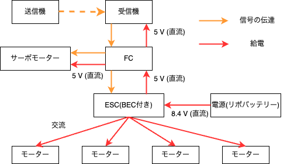
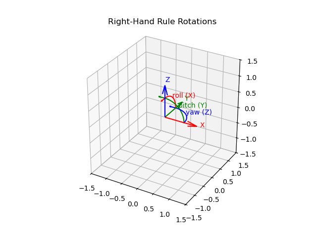
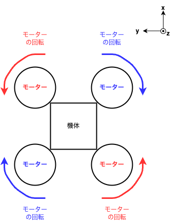
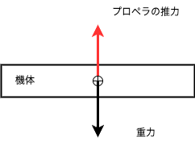
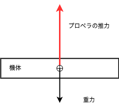
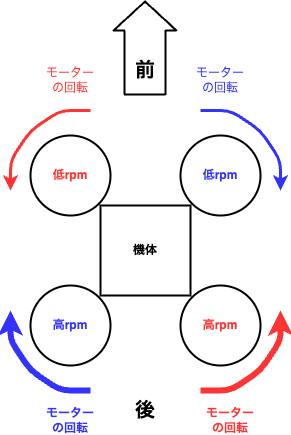
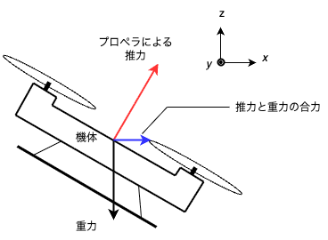
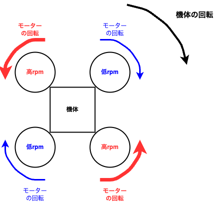

# マルチコプター基本講座


## マルチコプターの定義

`マルチコプター` : 複数の回転翼を機体に備えた航空機のこと

cf. 
ドローン : 広義の無人航空機。マルチコプター以外の機体(ヘリコプター、固定翼機)

したがって、マルチコプターはドローンの一種と言える。

## マルチコプターの写真
```
---ここに、実際のマルチコプターの写真を載せる---

  (マルチコプターの形状と、対応する写真を載せる)
```


## マルチコプターで使用する部品

### 受信機
プロポ(送信機)から送られてきた信号を受信する

### FC(フライトコントローラー)
受信機から送られたデータ、センサーによって取得したデータ等をもとに、モーターを制御する。

ex. 
Pixracer R15 PX4 Pixhawk​

### ESC(アンプ)
ESCに対して入力される信号は、`PWM(Pulse Width Modulation)`である。PWM周期に対する、デジタル信号がONの時間の比をDuty比(`Duty`)という。

$$
Duty = 100 \times \frac{T_{ON}}{T_{PWM}}
$$

$$
T_{PWM} : PWM周期　
$$
$$
T_{ON}  : デジタル信号がONの時間
$$

アクチュエーターを制御する際に、`Duty`を、各アクチュエーターに対して意味のある入力に変換する必要がある。`Duty`をモーターに意味のある量(入力電圧)に変換する素子がESCである。

ESCは入力された信号(PWM)に基づいて、モーターに流す電流を調整する。信号(PWM)はFCが生成し、FCから伝えられる。

ex. 
Hakrc　30a 4 in 1 esc ​

### ブラシレスモーター
マルチコプターや飛行機のプロペラを回転させるためには、基本的に三相交流モーターと呼ばれるモーターを使用している。モーターからは3本の配線がある。各々の配線に、位相が120°ずつ異なる交流電圧を入力する。

ESCと接続する配線のうち、2本を入れ替えると回転方向が変化する。

ex. 
​Dualsky ECO 2304C V2

### リポバッテリー(リチウムイオン​ポリマーバッテリー)
電力を供給するバッテリーとして、LiPoバッテリーを採用している。

バッテリーの出力電圧は、`セル数`によって決定する。

`1セル当たりの電圧` : `3.7 ~ 4.2 V`

航空研においては、2セルのバッテリーがよく用いられる。

ex.
Kypom K6 7.4V 1300mAh 35C70C

##### 注意
1セル当たりの電圧が3.7 Vを下回るようになると、そのリポバッテリーは二度と使用できない。
１セル当たりの電圧が3.8 V​を下回る前に充電する必要がある。

### サーボモーター
指定した角度だけ回転するモーター。信号線への入力によって、初期位置からの角度が変化する。

##### サーボモーターの配線(配線の色は一例)

|黒|赤|黄色|
|:-:|:-:|:-:|
|GND|5V|Signal|
|グラウンド|5 Vを入力|サーボへの信号を入力|


ex.
E-MAX デジタルマイクロサーボ ES9051​


### 回路図

{ width=60% }

## マルチコプターの原理

### 軸の導入(roll, pitch, yaw)

{ width=60% }

### プロポによる操作
プロポ : 飛行機やマルチコプターを操作するためのリモコン

進みたい方向などの信号を​受信機に送る​事ができる。

### プロペラの回転方向
対角線上にあるプロペラが、同じ方向に回転する。

モーターが回転すると、機体にはモーターの回転方向と逆方向にトルクが生じる(このトルクは、モーターの回転に対する反トルク)。機体全体では、機体が反トルクによって回転しないように、このトルク打ち消す必要がある。

{ width=25% }

### ホバリング
プロペラの推力と機体にかかる重力が釣り合った時、ホバリングする。

{ width=30% }

### 上昇
プロペラの推力が機体にかかる重力を上回ると、機体が上昇する。

{ width=30% }

### 前後(x, y軸)
移動したい方向のモーターの回転数(rpm)を下げることで移動を行う。

{ width=30% }
{ width=30% }

### yaw 回転

{ width=35% }

## クイズ

### 配線クイズ

茶色、赤色、黄色の配線は​それぞれどんな意味を持っている？

```
/---ここに、配線クイズの画像を載せる---/
    (実際の配線の画像)
    (5v, gnd, sigの配線があるもの(サーボの配線))
```